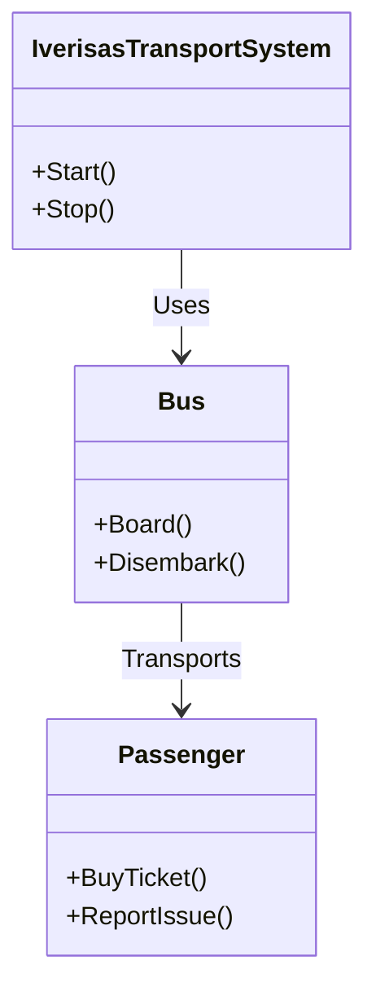

```mermaid
%%{ init : { "theme" : "default" } }%%
classDiagram
    class IverisasTransportSystem {
        +Start()
        +Stop()
    }

    class Bus {
        +Board()
        +Disembark()
    }

    class Passenger {
        +BuyTicket()
        +ReportIssue()
    }

    IverisasTransportSystem --> Bus : Uses
    Bus --> Passenger : Transports
```